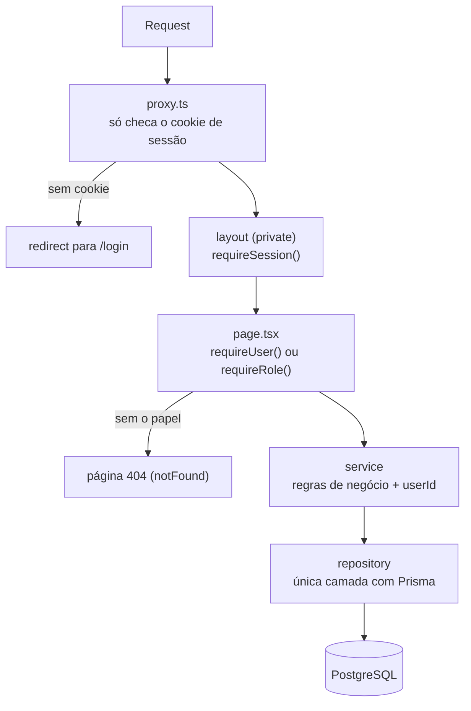
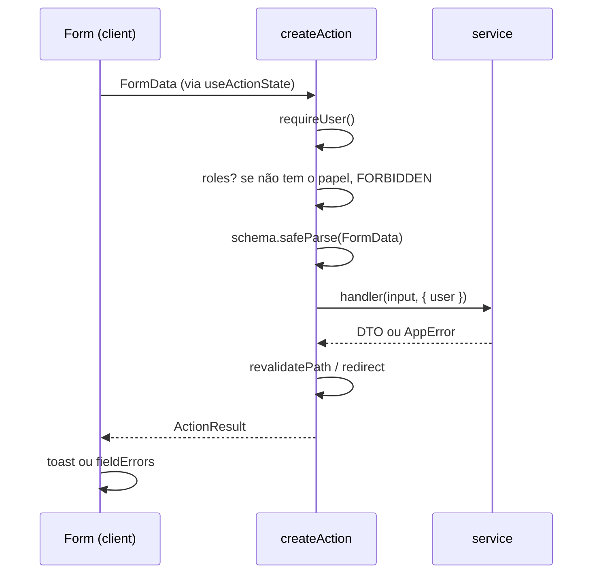

# Fluxo de uma request

Dois caminhos cobrem quase tudo no template: **carregar uma página** e
**executar uma server action**.

## 1. Página privada

- **`proxy.ts`** é uma checagem otimista: só olha se o cookie existe, sem
  consultar o banco. Serve para redirecionar rápido, não para proteger dados.
- **Layout** valida a sessão, mas layouts podem não re-renderizar em navegações
  parciais — por isso **a page também valida** e é a barreira de verdade.
- **Service** garante que o recurso é do usuário (`NotFoundError` se não for).

## 2. Server action

`ActionResult` é `{ ok: true, data }` ou `{ ok: false, error, code?, fieldErrors? }`
(`lib/actions/types.ts`). Erro de validação (`ZodError`) e erro de domínio
(`AppError`) viram `ok: false`; qualquer outro erro é logado e vira mensagem
genérica. Detalhes em `lib/actions/create-action.ts`.

## Quem protege o quê

| Camada              | O que faz                                         | É a barreira real? |
| ------------------- | ------------------------------------------------- | ------------------ |
| `proxy.ts`          | redireciona quem não tem cookie                   | não (otimista)     |
| layout `(private)`  | exige sessão válida                               | não (pode pular)   |
| `page.tsx`          | `requireUser()` / `requireRole()`                 | **sim**            |
| action              | `requireUser()` + `roles` no `createAction`       | **sim**            |
| service             | dono do recurso (`userId`), 404 quando não é dele | **sim**            |
| menu (`nav.config`) | `roles` só esconde o link                         | não (visual)       |

Regra prática: **nunca confie só no proxy, no layout ou no menu**.
